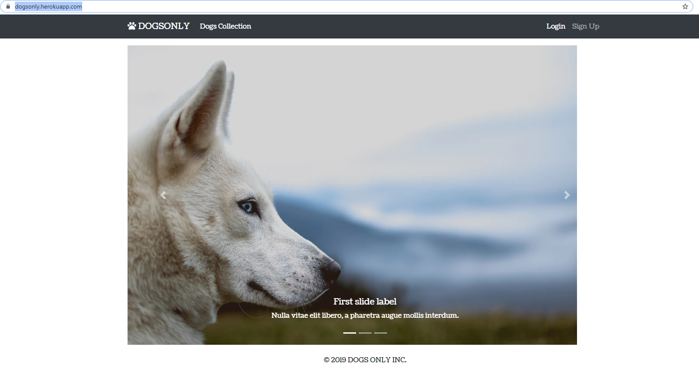

# DogsOnly :dog:
https://dogsonly.herokuapp.com/ <br>
A website that use TensorFlowJS that only allows logged in users to upload dogs picture<br>
</img>
<br>
## Technologies used
</img>
</img>
## Setting up
1. Select Node Package in `package.json` according to your computer:
  - If you have nvidia, choose @tensorflow/tfjs-node-gpu
  - Otherwise, choose @tensorflow/tfjs-node.

## To run project:
 1. npm install
 2. node app.js

## How to Deploy to heroku
 - Need to already make the app in heroku
</img>
```
$ touch Procfile
```
- Add this line to Procfile
```
web: node app
```
```bash
$ git init
$ heroku git:remote -a dogsonly
$ git add .
$ git commit -m "first commit"
```

- Remember to push to github
```
$ git branch -M main
$ git remote add origin https://github.com/Karenw1004/DogsOnly.git
$ git push -u origin main
```
